<div align="center">
<h2>🧶 CT2Yarn: Yarn-Level Reconstruction of Crochet from Computed Tomography (PG2026)</h2>

[**Chang Luo**](http://netbeifeng.github.io/) · [**Nobuyuki Umetani**](https://cgenglab.github.io/en/authors/admin/)

The University of Tokyo <br>

**Pacific Graphics 2026**

<a href="https://arxiv.org/abs/2609.06950"></a>
<a href="./pdf/paper.pdf"></a>
<a href='#'></a>
<a href='#'></a>
<a href='https://doi.org/10.5281/zenodo.22822228'></a>
</div>

[\[Arxiv\]](https://arxiv.org/abs/2609.06950)
[\[Paper\]](./pdf/paper.pdf)
[\[Project Page\]](#)
[\[Video\]](#)
[\[Dataset\]](https://doi.org/10.5281/zenodo.22822228)


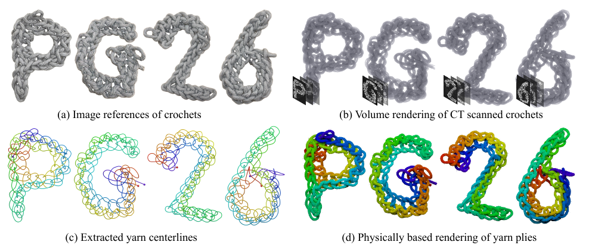

CT2Yarn recovers a single continuous yarn path from a micro-CT scan of a real crochet
object. Because yarn is hierarchical, the fiber orientations visible in a scan do not point
along the yarn. We estimate them with Gabor filtering, lift them to yarn level with an
anisotropic mean shift, skeletonize into fragments, and let a sketch-based GUI resolve what
stays ambiguous.

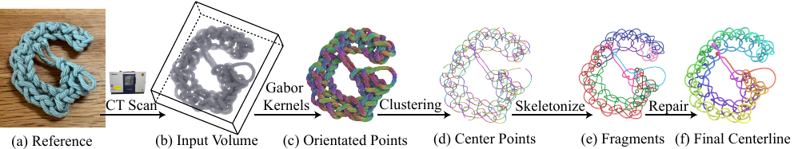

## Install

```bash
bash setup_env.sh
conda activate ct2yarn
```

## Data

18 micro-CT scans of real crocheted samples, each one continuous yarn. Photo on top, volume
rendering of its CT scan below.

### Letters and shapes

|  | `arrow` | `bar` | `G1` |
| :-- | :--: | :--: | :--: |
| **RGB photo** | 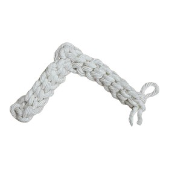 | 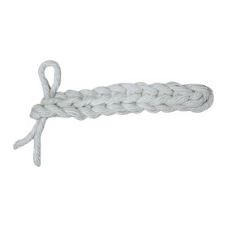 | 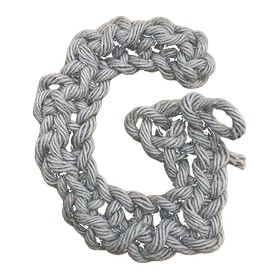 |
| **CT rendering** | 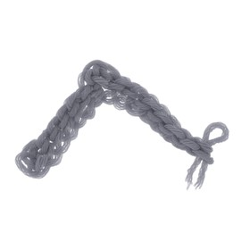 | 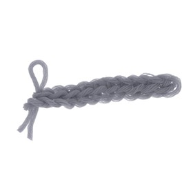 | 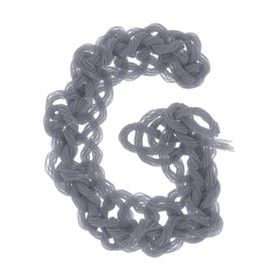 |
|  | `H` | `O` | `P` |
| **RGB photo** | 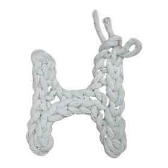 | 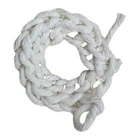 | 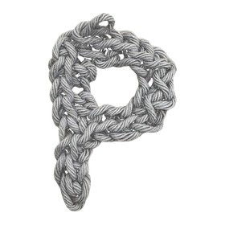 |
| **CT rendering** | 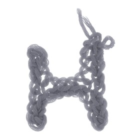 | 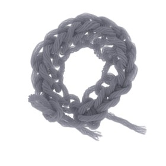 | 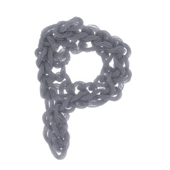 |
|  | `six` | `X` | `Y` |
| **RGB photo** | 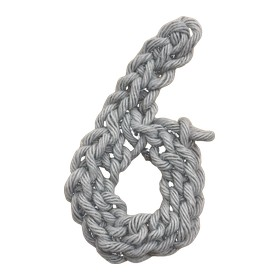 | 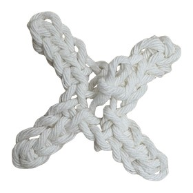 | 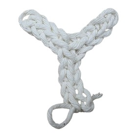 |
| **CT rendering** | 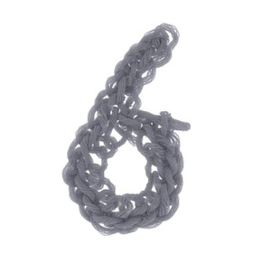 | 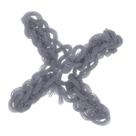 | 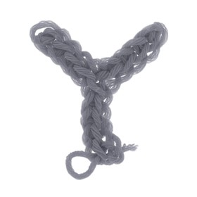 |

### Chain stitches

|  | `C_chain_stiches` | `O_chain_stiches` | `S_chain_stiches` |
| :-- | :--: | :--: | :--: |
| **RGB photo** | 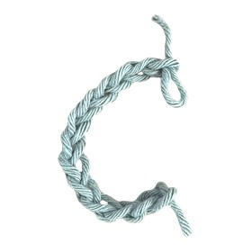 | 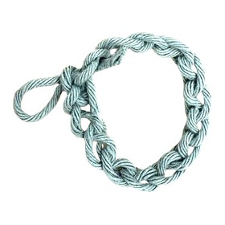 | 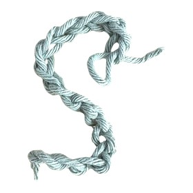 |
| **CT rendering** | 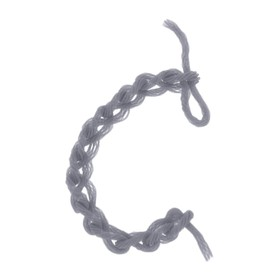 | 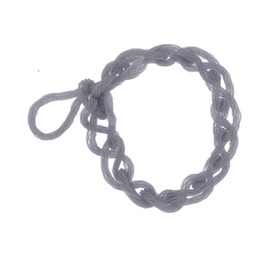 | 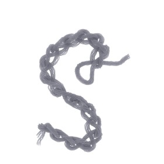 |

### Single-stitch patches

|  | `single_stiches_patch1` | `single_stiches_patch2` | `single_stiches_patch3` |
| :-- | :--: | :--: | :--: |
| **RGB photo** | 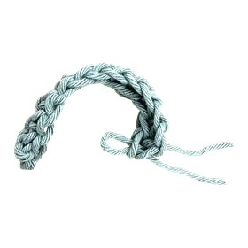 | 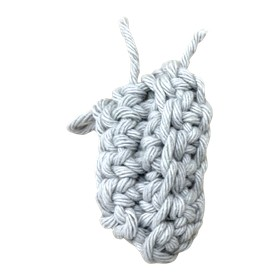 | 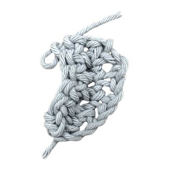 |
| **CT rendering** | 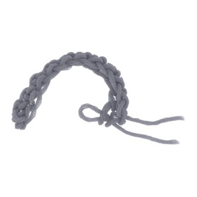 | 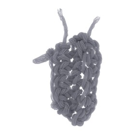 | 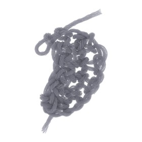 |

### Tension variation

|  | `two_loose` | `two_normal` | `two_tight` |
| :-- | :--: | :--: | :--: |
| **RGB photo** | 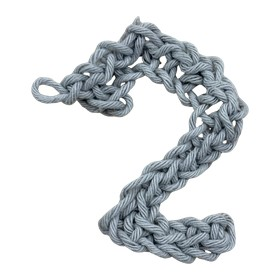 | 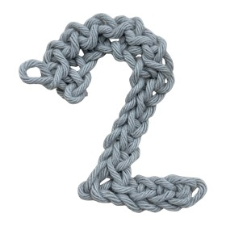 | 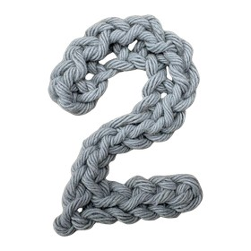 |
| **CT rendering** | 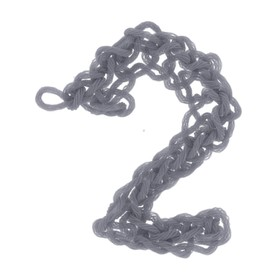 | 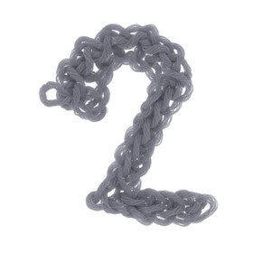 | 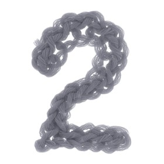 |

### Getting the volumes

Two ways in, depending on how much you want to reproduce.

| | Size | Where | Start at |
| :-- | :-- | :-- | :-- |
| **raw** | 27.35 GB | Zenodo, CC-BY-4.0 | step v0, the full pipeline |
| **processed** | 2.27 GB | GitHub release | step v2, Otsu already applied |

[](https://doi.org/10.5281/zenodo.22822228)

```bash
python download_data.py                    # raw, into data/raw
python download_data.py --processed        # processed, into data/processed
python download_data.py --sample bar G1    # just these
python download_data.py --list             # show what is on offer
python download_data.py --check            # see what is already on disk
```

[`download_data.py`](./download_data.py) uses the standard library only, so it runs before
you install anything, and it resumes an interrupted download rather than starting over.

The NRRD volumes open directly in [3D Slicer](https://www.slicer.org/) if you want to look
at the raw or processed scans before running anything.

## Preprocessing

```bash
bash run_preprocess.sh                 # every sample in ./data
bash run_preprocess.sh --sample bar    # one sample
```

Existing outputs are skipped, so an interrupted run resumes.

| Step | Script | Data flow | Device | Role |
| --- | --- | --- | --- | --- |
| v0 | [`preprocess/v0_threshold_denoise.py`](./preprocess/v0_threshold_denoise.py) | `raw` → `processed` | CPU | Otsu threshold denoising (Sec. 3.1) |
| v1 | [`preprocess/v1_estimate_yarn_diameter.py`](./preprocess/v1_estimate_yarn_diameter.py) | `processed` → `params/*.yaml` | CPU | optional, suggests Gabor parameters |
| v2 | [`preprocess/v2_gabor_pointcloud.py`](./preprocess/v2_gabor_pointcloud.py) | `processed` → `gabor` | GPU | Gabor oriented point cloud (Sec. 3.2) |
| v3 | [`preprocess/v3_united_denoise.py`](./preprocess/v3_united_denoise.py) | `gabor` → `denoised` | CPU | drops tangent-incoherent points |
| v4 | [`preprocess/v4_voxel_binning.py`](./preprocess/v4_voxel_binning.py) | `denoised` → `binned` | CPU | voxel binning, `DS=4` |

## Reconstruction

```bash
python reconstruction/v5_mean_shift.py \
    --npz data/binned/<sample>_pointcloud_full_energy_32000_linearity_0.03_ds4.npz
```

This opens the GUI, described under [User interface](#user-interface).

[`reconstruction/v6_view_yarn.py`](./reconstruction/v6_view_yarn.py) views a saved yarn as
one tube coloured along the path:

## User interface

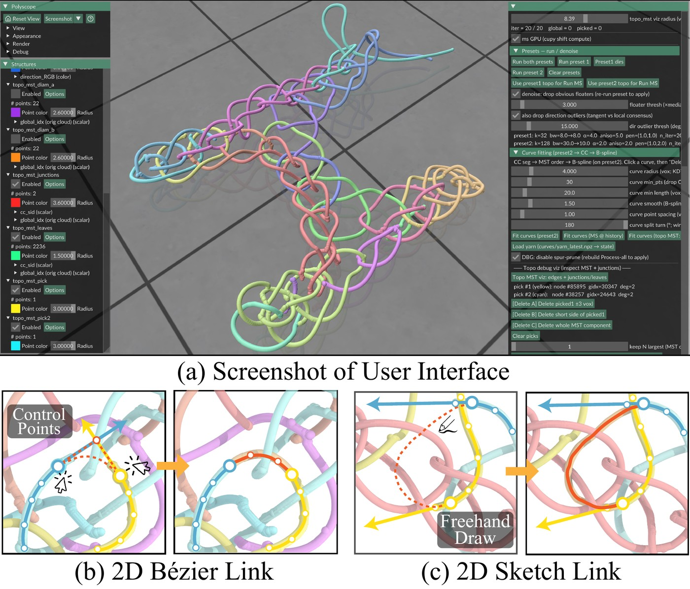

Four sections, one red button each.

| Section | Button | Does |
| :-- | :-- | :-- |
| Main MS loop | `Run` | anisotropic mean shift |
| Topology reconstruction | `Build Topology MST` | skeletonize, then repair by hand |
| Curve fitting | `Fit curves` | MST segments to smooth curves |
| Collapse solving | `Solve Collapse` | keeps only loop-free reconnections |

Repair keys: `A` straight bridge, `B` sketch bridge, `K` keep largest component, `D` cut a
collapse junction.

A bridge is drawn in 2D between two picked endpoints and back-projected to 3D, either as a
Bézier path with control handles or as a freehand sketch stroke.

## Applications

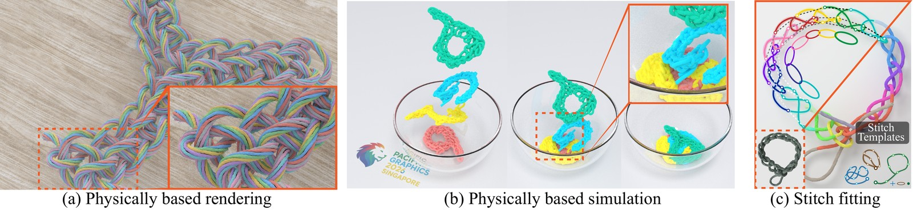

The recovered centerline feeds three downstream uses, all included here.

### Ply-level procedural yarn

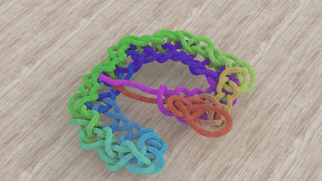

[`applications/yarn_plies.py`](./applications/yarn_plies.py) wraps the centerline with the
coaxial-helix ply model of Zhao et al. 2016. `--pitch` is the arc length of one revolution,
`--radius` the ply offset.

```bash
python applications/yarn_plies.py output/<stem>/curves/yarn_latest.npz
python applications/yarn_plies.py <yarn.npz> --n_plies 3 --pitch 80 --radius 12 --export
```

Opens a Polyscope viewer with live sliders. `--export` writes `yarn_plies_<ts>.npz` and an
`.obj`, `--fibers` splits plies into fibers, `--fly` adds flyaway hairs. Input is what the
GUI's `Save yarn` writes, no conversion needed.

### Physics simulation

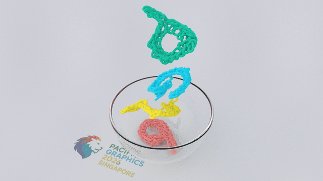

[`applications/yarn_sim_der.py`](./applications/yarn_sim_der.py) simulates the centerline as
a discrete elastic rod (Bergou et al. 2008) with linearly-implicit Euler. Only the
centerline is simulated, so a frame is rendered by re-running the ply decoration on the
deformed curve.

```bash
python applications/yarn_sim_der.py <yarn.npz> --mode drop --frames 300
python applications/yarn_sim_der.py <combined.npz> --mode bowl --gravity -3500 \
    --bowl_sdf applications/assets/glassbowl_sdf.npz --ground 0 --lift 0
```

`--mode drop` falls onto a ground plane, `--mode bowl` collides against a baked SDF. The
teaser above drops the four PG2026 letters into a glass bowl, whose SDF ships in
`applications/assets/`.

### Stitch pattern extraction

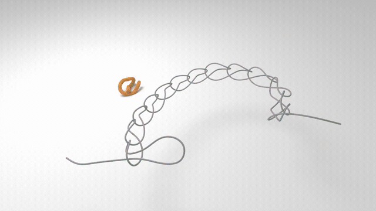

[`applications/yarn_stitches.py`](./applications/yarn_stitches.py) decomposes the
centerline into an ordered sequence of stitches. It computes arc-length curvature and its
autocorrelation to find candidate stitch periods, then labels each candidate by Kabsch
alignment against a small template library, taking the type of smallest RMSD and sliding the
boundary to the best fit.

```bash
python applications/yarn_stitches.py --npz output/<stem>/curves/yarn_latest.npz
```

The three canonical templates (chain, single, and a loose variant) ship in
`applications/assets/stitch_templates/`, and `--stitch_templates` points at a different
library. The viewer also exports a matched span with its camera for figure work.

### Rendering

[`applications/yarn_render.py`](./applications/yarn_render.py) renders it in Mitsuba 3,
fibers as `linearcurve` primitives and plies as swept tubes.

```bash
python applications/yarn_render.py <yarn.npz> --fibers --spp 256 --out render.png
python applications/yarn_render.py <yarn_plies_v1.npz> --bsdf hair --rainbow
```

Takes a centerline npz or an exported `yarn_plies_v1` npz. Falls back to CPU without a GPU.

## Citation
```
@inproceedings{ct2yarn_luo26,
   booktitle = {Pacific Graphics 2026 - Conference Papers and Posters},
   editor = {He, Ying and Thuerey, Nils and Liu, Lingjie},
   title = {{CT2Yarn: Yarn-Level Reconstruction of Crochet from Computed Tomography}},
   author = {Luo, Chang and Umetani, Nobuyuki},
   year = {2026},
   publisher = {The Eurographics Association},
   ISBN = {978-3-03868-327-8},
   DOI = {10.2312/pg.20261024}
}
```

## License

| | License |
| :-- | :-- |
| Code | MIT, see [LICENSE](./LICENSE) |
| Paper | [CC BY 4.0](https://creativecommons.org/licenses/by/4.0/), Eurographics Association |
| Dataset | [CC BY 4.0](https://creativecommons.org/licenses/by/4.0/) on Zenodo |

The MIT licence in [LICENSE](./LICENSE) covers the code in this repository only. The paper
and the dataset keep their own terms as listed above.


## Reference
- CT2Hair, Shen et al., ACM TOG 42(4), 2023: https://doi.org/10.1145/3592106
- Polyscope: https://polyscope.run/
